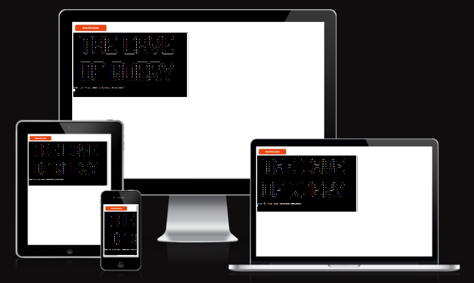
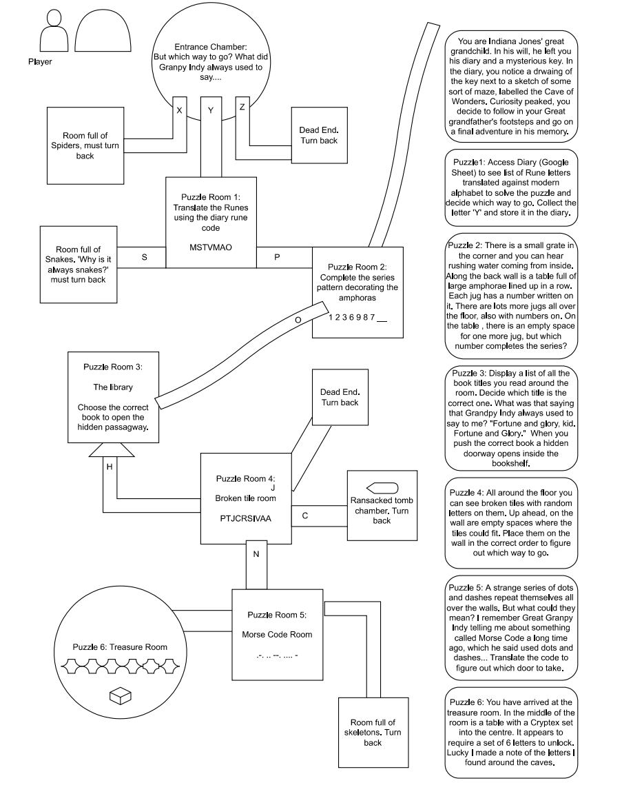
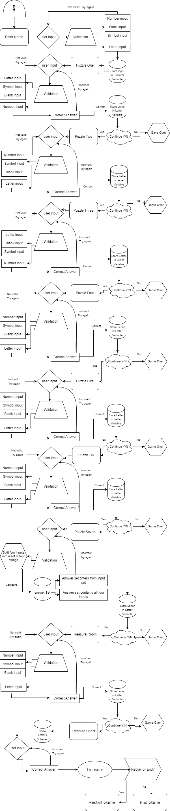
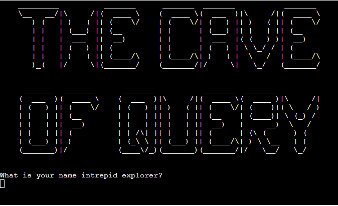
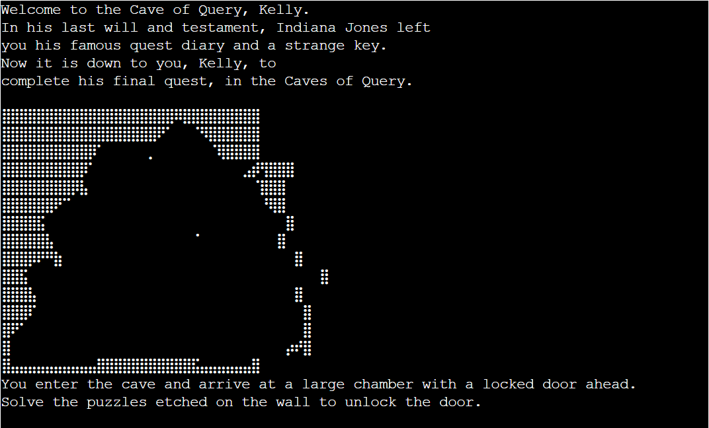
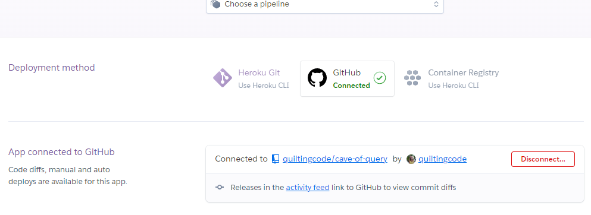
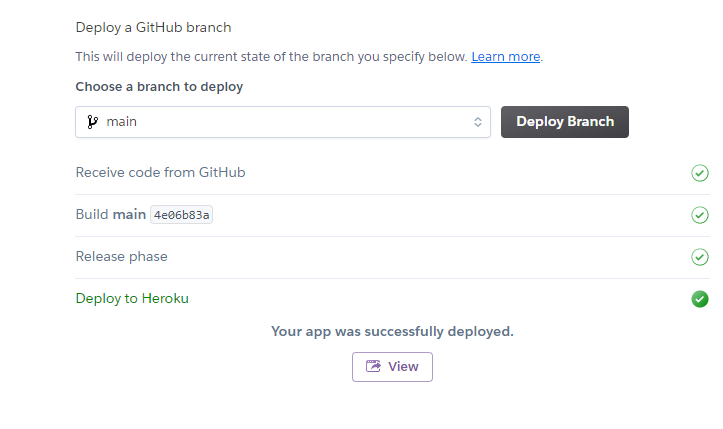

# **_The Cave of Query_**

The Cave of Query is an interactive text-based adventure game filled with brain teasers and Indiana Jones trivia. 

It is built using Python and runs through the Code institute mock terminal on Heroku.

Welcome to <a href="https://cave-of-query.herokuapp.com/" target="_blank" rel="noopener">The Cave of Query</a>

# Contents

* [**User Experience UX**](<#user-experience-ux>)
    * [Game Design](<#game-design>)
    * [Flowchart](<#flowchart>)
* [**Current Features**](<#current-features>)
    * [Title Page](<#title-page>)
    * [Game Introduction](<#game-introduction>)
    * [Puzzle Rooms](<#puzzle-rooms>)
    * [End of Game Page](<#end-of-game-page>)
* [**Future Features**](<#future-features>)
* [**Technologies Used**](<#technologies-used>)
* [**Testing**](<#testing>)
* [**Deployment**](<#deployment>)
* [**Credits**](<#credits>)
    * [**Content**](<#content>)
    * [**Media**](<#media>)
*  [**Acknowledgements**](<#acknowledgements>)

# User Experience (UX)

## Game Design

Initially, I had the idea that I wanted to create a text-based adventure game based around the famous character of Indiana Jones with a treasure-hunting theme. This would be mixed with the recently fashionable 'escape room' games where players have to solve puzzles or brain teasers in order to move forward in the game. 

I sketched out a basic cave system to base my coding on, so that I could better visualize the path the user would take through the game. 

[Back to top](<#contents>)

## Flowchart

The Cave of Query flowchart was designed using the free flowchart website [Diagrams.Net](https://www.diagrams.net/)

The user enters the game by inputting their name. This input is validated to make sure that at least one alpha character is entered, and then it is stored in a Name variable and the user enters the Cave.

The Cave of Query consists of seven puzzle rooms and a treasure room. The user has to work their way through each of the puzzles to reach the treasure. This is the 'escape room' concept but turned on it's head as the user is trying to get in, not out. 

Each puzzle room contains a different brain teaser for the user to solve. if they input the correct answer, they win a letter which is stored in a variable and they are given the option to move forward to the next room or give up.

If they give up, the game ends and resets back to the Home Page. If they continue on through each puzzle room, they will reach the treasure chest. In order to open the chest and gain access to the treasure, they have to use all the letters they have collected along the way which form a word.

At the end of the game, they can choose to play again, or not.

[Back to top](<#contents>)

# Current Features

  
## Title Page

Across the main home page screen, when you run the program, you are introduced to the game title 'The Cave of Query' and you are asked to enter your name, which starts the game. 

[Back to top](<#contents>)

## Game Introduction

Once the user has entered their name, they enter the cave and they are given an introduction to the user story. The player is the grandchild of the infamous Indiana Jones. In his last will and testament, he leaves you an old key and his diary, where he used to write all his treasure-hunting information. In the diary, you find information about the Caves of Query, a quest Indiana never managed to complete. 

In his stead, you decide to travel to the Caves of Query and try your luck, after all you have the Jones' explorer genes. You have brought the diary and the key with you. 

I used [Ascii Art](https://emojicombos.com/cave-entrance-dot-art) to print an image of a cave in this introduction section. I didn't want to bog the user down with a whole page of introduction text to get them into the spirit of the game, but at the same time, I wanted to give them something to let them visualise going into the game area. A text-based game like this relys a lot on the user's imagination so at least this gives them a little prompt. 

[Back to top](<#contents>)

## Puzzle Rooms

Each puzzle room contains a different type of puzzle. These range from maths puzzles, to anagrams, to deciphering strange languages. If the user types in the wrong answer, I have tried to give them a hint to steer them in the right direction towards the correct answer. 

The validation makes the input not case sensetive, so if they type the correct word in either upper or lower case, it will still pass as correct. 

A lot of the puzzles contain Indiana Jones trivia. Both the two language decipher puzzles are Indiana quotes, and also the library book challenge is one of Indiana's most famous quotes as well. 

The letters collected throughout the game spell: 'Pythonic'. This is both a play on the language I have been using throughout this project to build the game but also Indiana Jones' greatest fear; snakes!

[Back to top](<#contents>)

## End of Game Page

Once 12 questions have been answered, when the user clicks the 'End' button the quiz is finished, the questions disappear and they are replaced by a summary of how well the user did. If they score more than 80 points, they will see an image of a very happy Sidekick and a message congratulating them on their score.

[Back to top](<#contents>)

## Future Features 

In the future, I would like to add more features to the Disney Sidekicks Quiz. These could include:

* Music-related questions with audio elements
* Add more questions to the questions array as new Disney films are released. 
* Eventually I could expand on my theme of Disney quizzes, and offer a list of categories for the player to choose from on the home page. For example:
  * Disney Villains
  * Disney Princesses
  * Disney Theme Tunes
  * Disney quotes

[Back to top](<#contents>)

# Technologies Used

I used the following technologies to create this website:

* Python – Content and structure
* Gitpod – Website deployment
* Github – Website code repository
* Heroku - Hosting platform for the game
* Diagrams.net - Create the game layout and flowchart

[Back to top](<#contents>)

# Testing

Please click [**_here_**](TESTING.md) to read more information about testing The Cave of Query

[Back to top](<#contents>)

# Deployment

### **To deploy the project**
The game was deployed via an online platform called as Heroku, used to improve user experience when viewing a program written in code such as Python. The deployment process is as follows:

1. Create new Heroku app from Heroku dashboard
2. Choose an app name that is available.
3. Choose the region where you are working from (Europe)
4. Select the create app button
5. Select 'Settings' from the main menu
6. Scroll to 'Config Vars' section and select 'Reveal Config Vars'
7. In the 'Key' field input 'PORT' in the 'Value' field input '8000'
8. Press 'Add' to add the value just entered
9. Repeat this process to create a key called 'CREDS' and paste the values in from the CREDS.Json file in Gitpod to hide sensetive data from the user.
10. Scroll down to 'Add buildpack' and select it
11. Select 'Python' and save changes
12. Select 'Add buildpack' again and do the same with 'NodeJs'
13. Link the App to your matching GitHub repository 
13. Select Automatic deploy

  The live link to the Github repository can be found here - https://cave-of-query.herokuapp.com/

### **To fork the repository using GitHub**
A copy of the GitHub Repository can be made by forking the GitHub account. This copy can be viewed and changes can be made to the copy without affecting the original repository. Take the following steps to fork the repository:
1. Log in to **GitHub** and locate the [repository](https://github.com/quiltingcode/disneysidekicks).
2. On the right hand side of the page inline with the repository name is a button called **'Fork'**, click on the button to create a copy of the original repository in your GitHub Account.

### **To create a local clone of this project**
The method from cloning a project from GitHub is below:

1. Under the repository’s name, click on the **code** tab.
2. In the **Clone with HTTPS** section, click on the clipboard icon to copy the given URL.

3. In your IDE of choice, open **Git Bash**.
4. Change the current working directory to the location where you want the cloned directory to be made.
5. Type **git clone**, and then paste the URL copied from GitHub.
6. Press **enter** and the local clone will be created.

[Back to top](<#contents>)

# Credits
### Content

* The colour scheme was researched from the following websites:
    * https://www.sitepoint.com/15-color-schemes-from-disney-heroes-and-villains/
    * https://www.schemecolor.com/disney-color.php
* Tutorials on how to create a quiz game with javascript were found on Youtube. One by [Web Dev Simplified](https://www.youtube.com/watch?v=riDzcEQbX6k) and another by [Brian Design](https://www.youtube.com/watch?v=f4fB9Xg2JEY)
* I also watched another tutorial by [Web Dev Simplified](https://www.youtube.com/watch?v=rIO5326FgPE) explaining the CSS Box Model, to help create the various game containers.
* Information for how to Hide and Show Divs was taken from [W3Schools](W3schools.com/howto/howto_js_toggle_hide_show.asp)
* [Balsamiq](https://balsamiq.com/wireframes/) was used to create the wireframes.
* The Favicon in the browser was created in https://favicon.io/
* The fonts were taken from [Google Fonts](https://fonts.google.com/)
* I used two different websites for help learning how to shuffle the questions array each time a game was started. I used [Geeks for Geeks](https://www.geeksforgeeks.org/shuffle-or-randomize-a-list-in-java/) and [Sebhastian.com](https://sebhastian.com/shuffle-array-javascript/#:~:text=A%20JavaScript%20array%20elements%20can,using%20the%20sort()%20method.&text=The%20JavaScript%20Array%20sort(),value%20returned%20by%20that%20function.)
* The quiz questions were created with the aid of [Bustle.com](https://www.bustle.com/entertainment/91807-35-disney-sidekicks-ranked-from-meeko-flit-to-the-seven-dwarves)
* I used a YouTube tutorial by [The Coding Train](https://www.youtube.com/watch?v=MLtAMg9_Svw) to learn how to add a countdown timer element to the page.
* Information for how to start a countdown timer from a button click was found at [W3Schools](https://www.w3schools.com/jsref/met_element_addeventlistener.asp) 
* Information for how to restore spliced items from an array was found at [Stack Overflow](https://stackoverflow.com/questions/58220174/bring-all-items-back-in-an-array-after-using-splice-to-remove-them)
 

### Media
* The images used in this website were sourced from:
  * imgbin.com
  * pngwing.com
* The background image was sourced from https://fondosmil.com/disney
* The question images were compressed using [TinyPNG](https://tinypng.com/)
* The stopwatch icon is from [Font Awesome](https://fontawesome.com/v5/icons/stopwatch?s=regular&f=classic)
* I used [remove.bg](https://www.remove.bg/upload) to remove the background on to the two magic carpet images used in the End Page.

[Back to top](<#contents>)

# Acknowledgements
The site was completed as a Portfolio Project 2 piece for the Full Stack Software Developer (e-Commerce) Diploma at the [Code Institute](https://codeinstitute.net/). As such I would like to thank my mentor [Precious Ijege](https://www.linkedin.com/in/precious-ijege-908a00168/), the Slack community, and all at the Code Institute for their help and support. I love Disney, and it was a joy to be able to create a quiz dedicated to something I'm really passionate about.

Kelly Hutchison 2022.

[Back to top](<#contents>)