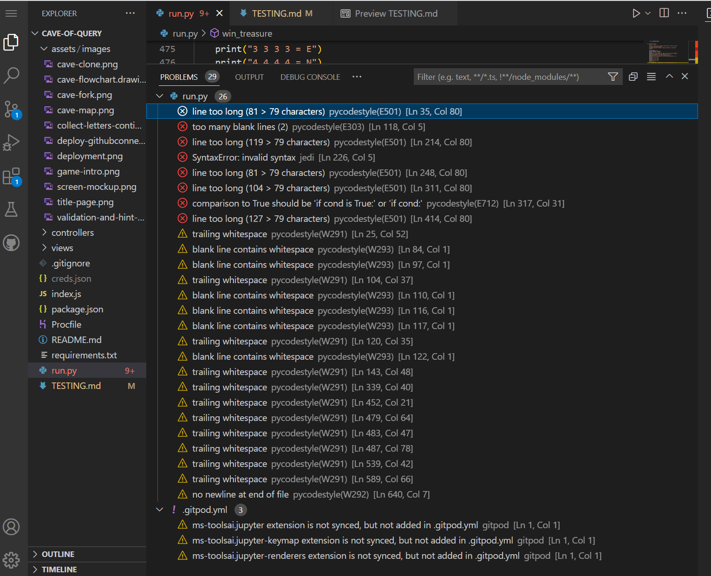

# **_The Cave of Query_**

# Testing

## Code Validation

The Cave of Query site has been passed through the internal PEP8 validation tests which I installed into GitPod. The method I used to do this was as per the Slack Article written by kevin_ci on the 28th September 2022 in #announcements, since the PEP8online website no longer works:

1. Run the command 'pip3 install pycodestyle'
2. Press Ctrl+Shift+P
3. Type 'linter' into the search field
4. Select 'Python: Select Linter
5. Select 'pycodestyle' from the list
6. Select the 3 lines menu in the top left hand corner. Select 'View' and then 'Problems'. 
6. PEP8 errors are now displayed in a list as well as being underlined in red in the central editor window. 

## Browser Compatibility 

The Cave of Query was tested on the following browsers:

- Google Chrome
- Microsoft Edge
- Mozilla Firefox

I do not have any Apple devices available to carry out testing on a Safari browser. Appearance and functionality appear to be consistent throughout all browsers.

## Known Bugs

### Resolved

1. As a result of the PEP8 validation in GitPod the following 29 problems were detected: 

I removed all the white spaces and blank lines. I have also checked in slack regarding the 3 warnings relating to 'jupyter - keymap extension is not synced, but not added in gitpod' and there are replies fromm mentors that say this issue is nothing to do with my project and I can ignore it, so I have. 

I was left with 5 errors relating to line too long, and one error 'No newline at end of file'. 

2. User input Validation - Each puzzle room has a separate user input field with a unique correct input required. At first, if the wrong answer was input, an error would occur and the game would break. 
I added code to convert the input in the number puzzles 1 and 3 to integers. If a number was not entered and this conversion was not possible, I created an exception Value Error to stop the game breaking. 
In the remaining puzzles where a letter string is required, I wanted to use the validation if input.isalpha() but this doesn't work, as all inputs automatically are converted into strings, so numbers, and special characters pass this validation. In these cases, the game won't break but simply compares any user input with the correct answer and gives an error message back if the two don't match. 

3. In puzzles 2 and 6, the game prints out a decoder dictionary to help the user decode the puzzle. However, the dictionary list printed in a very long line, giving a bad user experience, and based on the functionality of the Heroku app whereby it prints from the bottom up, the user was losing valuable information above the dictionary list, and it wasn't altogether obvious that they should scroll back up the terminal to read it before attempting the puzzle. I therefore reached out to tutor support to help me split the print out of the dictionary into two separate columns. The way they suggested I do this was to convert the key values from alphabet letters to their corresponding ASCII numbers, which could then be entered as a range to display on separate sides of the screen. 

4. For puzzle 7, the user is asked to solve a riddle, and the answer consists of four separate words. I wanted the user to be able to enter the four words in any order, and get a correct response if the four words matched the four correct answeres. I initially thought about sorting the four answers into alphabetical order but I didn't have much success with the sort() method, as it wasn't reading the four inputs correctly. I read an article on [Stack Overflow](https://stackoverflow.com/questions/8866652/determine-if-2-lists-have-the-same-elements-regardless-of-order) which gave me the idea firstly to use the split() method to convert the four words into separate strings and then I used the set() method to convert the strings to a set in which order is unimportant. I tested this in [Python Tutor](https://pythontutor.com/cp/composingprograms.html#mode=edit) to check the way this conversion would work. In this way I could see the four words correctly converted into a set and compared with the answer set. Regardless of order, if the four words in both sets, a correct response was sent back to the terminal.

5. On printing the letters collected to the user, it printed each time with the [] list brackets around them, which is not so visually nice to look at when playing the game. I read an article on [Python Pool](https://www.pythonpool.com/remove-brackets-from-list-python/) which gave me the idea of how to remove these brackets when printing a list to the user terminal.

6. On testing the game in the Heroku app, I wasn't happy with the print out within the confines of the small container window. The user was losing a lot of valuable information as they played if they didn't keep scrolling up to check what was printed above but not seen. I created a new function to ask the user whether they wanted to continue or quit the game which would appear at the end of each puzzle room. In this way, the screen would scroll down to display to the end of this small function, but the user could then still see the valuable 'letters collected' information which is really important for winning the final puzzle. 

### Unresolved

1. I wanted to add a clear() function between each puzzle, as the Heroku platform game container is very small, and sometimes (especially in puzzles 2 and 6 where decoder dictionaries are displayed) there is a lot of text to display on the screen all at once. Firstly, the clear function doesn't actually clear all the previous elements of the game, only what is visible in the screen at the time. Secondly, it clears the screen so fast that sometimes, the user loses valuable information before they even had time to read it, when the clear() was set at the end of a puzzle room. So I removed this function as it made for a bad user experience, although I still wasn't entirely happy with the output display in the Heroku app. 

## Additional Testing

## Peer Review

In addition to the above tests, I asked my peers to play this quiz and their overall response was very positive. 

1. They suggested I add a few hints along the way if the user inputs an incorrect answer, so this was implemented.

2. They suggested that in puzzle 6, the morse code sentence is written out with forward slashes between each word to mark out each separate word. It appeared confusing, and users tried to input the answer with forward slashes between each word which didn't pass validation. I therefore removed the forward slashes and replaced them with the word '(space)'. 
 

Please click [**_here_**](README.md) to return to the Cave of Query README file.